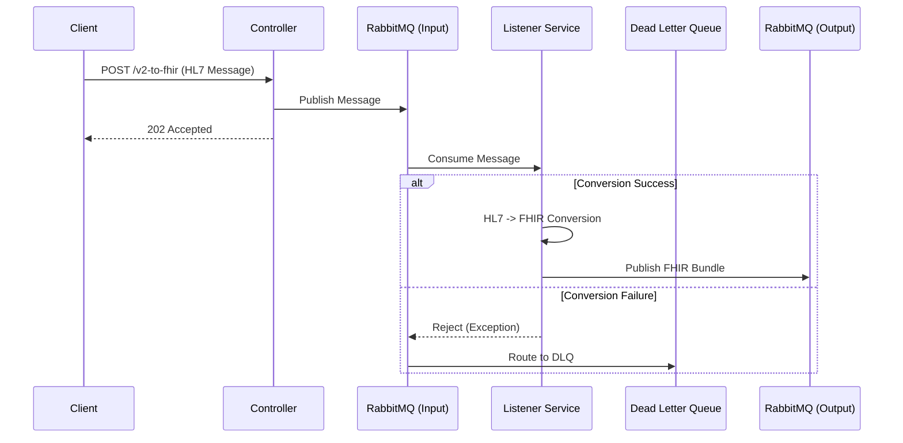

# FHIR Transformer


A high-performance, event-driven integration service bridging **Legacy HL7 v2** systems and Modern **FHIR R4** healthcare standards. Built for high reliability and scalability using Spring Boot 4.0 and RabbitMQ.

## 🚀 Key Features

*   **Bi-Directional Conversion**:
    *   **HL7 v2 -> FHIR R4**: Converts ADT (A01, A08, etc.) messages to FHIR Bundles.
    *   **FHIR R4 -> HL7 v2**: Converts FHIR Bundles (Patient, Encounter) back to HL7 v2.5 ADT messages.
*   **Event-Driven Architecture**: Fully asynchronous processing pipeline using RabbitMQ.
*   **Reliability**: Built-in **Dead Letter Queue (DLQ)** handling for failed messages.
*   **Observability**: Integrated **Spring Boot Actuator** for health checks and metrics.
*   **Containerized**: Production-ready Docker images and Compose setup.

---

## 🛠️ Technical Stack

*   **Language**: Java 21 (Eclipse Temurin)
*   **Framework**: Spring Boot 4.0.1
*   **Libraries**: 
    *   HAPI FHIR 7.6.1 (Latest Stable)
    *   HAPI HL7 v2 2.5.1
*   **Messaging**: RabbitMQ (AMQP)
*   **Build**: Maven 3.9+
*   **Container**: Docker & Docker Compose

---

## 🏗️ Architecture

The system uses an asynchronous "fire-and-forget" pattern for high throughput.



### Queue Topology
| Queue Name | Type | Purpose |
| :--- | :--- | :--- |
| `hl7-messages-queue` | Input (HL7) | Receives raw HL7 messages for processing (To FHIR). |
| `hl7-messages-dlq` | DLQ | Stores failed HL7 messages. |
| `fhir-messages-queue` | Output (FHIR) | Stores successfully converted FHIR Bundles. |
| `fhir-to-v2-queue` | Input (FHIR) | **[NEW]** Receives FHIR Bundles for conversion to HL7. |
| `v2-messages-output-queue` | Output (HL7) | **[NEW]** Stores successfully converted HL7 messages. |

---

## 🏃 Quick Start

### Option 1: Docker (Recommended)
This spins up the Transformer and a RabbitMQ instance.

```bash
docker-compose up -d --build
```
*   **API**: `http://localhost:8080`
*   **RabbitMQ Console**: `http://localhost:15672` (User: `guest` / Pass: `guest`)

### Option 2: Local Java
Requires a local RabbitMQ instance running on port 5672.

```bash
mvn clean package
java -jar target/fhir-transformer-0.0.1-SNAPSHOT.jar
```

---

## 🔌 API Reference

### 1. HL7 to FHIR (Async)
**Endpoint**: `POST /api/convert/v2-to-fhir`
**Body**: Raw HL7 v2 Message (Pipe-delimited)
**Response**: `202 Accepted`

### 2. HL7 to FHIR (Sync / Debug)
**Endpoint**: `POST /api/convert/v2-to-fhir-sync`
**Body**: Raw HL7 Message
**Response**: `200 OK` (FHIR Bundle JSON)

### 3. FHIR to HL7 v2 (Async)
**Endpoint**: `POST /api/convert/fhir-to-v2`
**Body**: FHIR R4 Bundle JSON
**Response**: `202 Accepted`
**Behavior**: Queues message, converts in background, output to `v2-messages-output-queue`.

### 4. FHIR to HL7 v2 (Sync / Debug)
**Endpoint**: `POST /api/convert/fhir-to-v2-sync`
**Body**: FHIR R4 Bundle JSON
**Response**: `200 OK` (HL7 Message string)

### 5. Observability
*   **Health**: `GET /actuator/health`
*   **Metrics**: `GET /actuator/metrics`

---

## 🧪 Testing

The project includes a comprehensive **Postman Collection** covering all scenarios.

### Running Tests (Newman)
You can run the full integration suite locally using Newman (Docker stack must be running):

```bash
newman run postman/FHIR_Transformer.postman_collection.json -e postman/FHIRTransformer.local.postman_environment.json
```

**Scenarios Covered**:
*   Async & Sync ADT^A01
*   Sync ADT^A08 (Patient Update)
*   FHIR to HL7 (With and Without Encounter)
*   Error Handling
*   Health & Metrics Checks

---

## ⚙️ Configuration

Key properties in `application.properties`:

```properties
# RabbitMQ
spring.rabbitmq.host=localhost
app.rabbitmq.queue=hl7-messages-queue
app.rabbitmq.output-queue=fhir-messages-queue

# Dead Letter Queue
app.rabbitmq.dlq=hl7-messages-dlq
app.rabbitmq.dlx=hl7-messages-dlx

# Actuator
management.endpoints.web.exposure.include=health,info,metrics
```

## 📜 License
MIT
