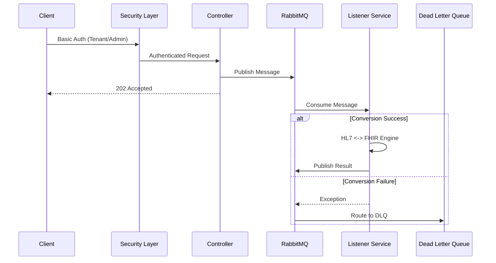

# FHIR Transformer Service


A high-performance, secure, and multi-tenant integration service bridging **Legacy HL7 v2** systems and Modern **FHIR R4** healthcare standards. Built for reliability and scalability using Spring Boot 4.0, MongoDB, and RabbitMQ.

## 🚀 Key Features

*   **Bi-Directional Conversion**:
    *   **HL7 v2 -> FHIR R4**: Converts ADT (A01, A08) messages to FHIR Bundles.
    *   **FHIR R4 -> HL7 v2**: Converts FHIR Bundles (Patient, Encounter) back to HL7 v2.5 ADT messages.
*   **Multi-Tenancy**: Dynamic tenant onboarding with isolated credentials and Role-Based Access Control (RBAC).
*   **Event-Driven Architecture**: Fully asynchronous processing pipeline using RabbitMQ.
*   **Enterprise Security**:
    *   **DoS Protection**: Pre-computed credential hashing to prevent CPU exhaustion.
    *   **Fail-Closed Security**: Default deny-all policy for unknown endpoints.
    *   **Secure Observability**: Metrics restricted to Admin users.
*   **Reliability**: Built-in **Dead Letter Queue (DLQ)** handling for failed messages.
*   **Containerized**: Production-ready Docker images and Compose setup.

---

## 🛠️ Technical Stack

*   **Language**: Java 21 (Eclipse Temurin)
*   **Framework**: Spring Boot 4.0.1 (Web, Security, Data-Mongo, AMQP, Actuator)
*   **Libraries**: 
    *   HAPI FHIR 7.6.1 (Latest Stable)
    *   HAPI HL7 v2 2.5.1
*   **Database**: MongoDB (Tenant Credentials)
*   **Messaging**: RabbitMQ (AMQP)
*   **Build**: Maven 3.9+

---

## 🏗️ Architecture

The system uses an asynchronous "fire-and-forget" pattern for high throughput, backed by a persistent queue system.



---

## 🛡️ Security Architecture

The application implements a robust **Role-Based Access Control (RBAC)** system.

### Roles & Permissions
| Role | Description | Access |
| :--- | :--- | :--- |
| `ADMIN` | System Administrator | Tenant Management (`/api/tenants/**`), Actuators (`/actuator/**`), Conversions. |
| `TENANT` | Integration User | Conversion Endpoints (`/api/convert/**`). |

### Security Configurations
*   **Authentication**: HTTP Basic Auth.
*   **Logging**: User inputs are sanitized to prevent Log Injection. Passwords are never logged.
*   **Defaults**: The system is configured to "Fail Closed" - any unsecured endpoint is blocked by default.

### 🔑 Production Secrets
**DO NOT** leave secrets hardcoded. Configure the following Environment Variables in production:

| Variable | Default (Dev) | Description |
| :--- | :--- | :--- |
| `ADMIN_USERNAME` | `admin` | Username for the System Admin. |
| `ADMIN_PASSWORD` | `admin123` | Password for the System Admin. |
| `RABBITMQ_PASSWORD`| `guest` | Password for RabbitMQ user. |
| `MONGODB_URI` | `mongodb://...` | Connection string for MongoDB. |

---

## 🏃 Quick Start

### Option 1: Docker (Recommended)
Spins up the Transformer, MongoDB, and RabbitMQ.

```bash
docker-compose up -d --build
```
*   **API**: `http://localhost:9090`
*   **RabbitMQ Console**: `http://localhost:15672` (guest/guest)

### Option 2: Local Java
Requires local Mongo (27017) and RabbitMQ (5672).

```bash
mvn clean package
java -jar target/fhir-transformer-0.0.1-SNAPSHOT.jar
```

---

## 🔌 API Reference

### 1. Tenant Management (Admin Only)

*   **Onboard Tenant**
    *   `POST /api/tenants/onboard`
    *   Body: `{ "tenantId": "tenant1", "password": "...", "name": "Hospital A" }`
*   **Update Tenant**
    *   `PUT /api/tenants/{tenantId}`
*   **Delete Tenant**
    *   `DELETE /api/tenants/{tenantId}`

### 2. HL7 to FHIR
*   **Async**: `POST /api/convert/v2-to-fhir` (Returns `202 Accepted`)
*   **Sync**: `POST /api/convert/v2-to-fhir-sync` (Returns `200 OK` with Bundle)

### 3. FHIR to HL7
*   **Async**: `POST /api/convert/fhir-to-v2` (Returns `202 Accepted`)
*   **Sync**: `POST /api/convert/fhir-to-v2-sync` (Returns `200 OK` with HL7 Message)

### 4. Observability (Admin Only)
*   **Health**: `GET /actuator/health`
*   **Metrics**: `GET /actuator/metrics`

---

## 🧪 Testing

The project uses a **Postman Collection** that implements a complete lifecycle test strategy.

### Lifecycle Flow
1.  **Setup**: Admin onboards a new Tenant (`tenant1`).
2.  **Execution**: `tenant1` performs ~10 different conversion tests (Async, Sync, Negative cases).
3.  **Teardown**: Admin updates and then deletes `tenant1`.

### Running Tests (Newman)
Ensure the stack is running (Docker), then execute:

```bash
newman run postman/FHIR_Transformer.postman_collection.json -e postman/FHIRTransformer.local.postman_environment.json
```

**Passing Criteria**: All 36 assertions must pass.

---

## ⚙️ App Configuration

Key `application.properties` highlights:

```properties
# Secrets (Env Var > Default)
app.admin.password=${ADMIN_PASSWORD:admin123}

# RabbitMQ Tuning
spring.rabbitmq.listener.simple.concurrency=5
spring.rabbitmq.listener.simple.max-concurrency=10
spring.rabbitmq.listener.simple.prefetch=1

# Actuator Security
management.endpoints.web.exposure.include=health,info,metrics
# Note: Access restricted by SecurityConfig to ADMIN role.
```

## 📜 License
MIT
