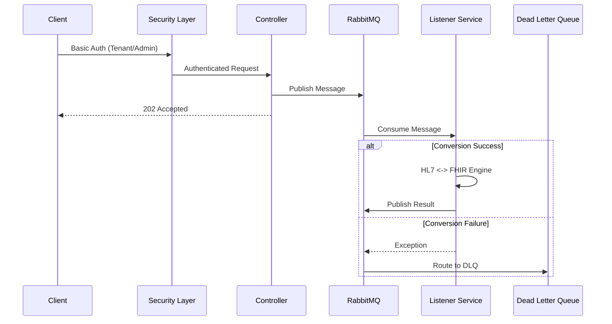

# FHIR Transformer Service


A high-performance, secure, and multi-tenant integration service bridging **Legacy HL7 v2** systems and Modern **FHIR R4** healthcare standards. Built for reliability and scalability using Spring Boot 4.0, MongoDB, and RabbitMQ.

## 🚀 Key Features

*   **Bi-Directional Conversion**:
    *   **HL7 v2 -> FHIR R4**: Converts ADT (A01, A03, A08) messages to FHIR Bundles including Patient (PID + Death), Encounter (Admit/Discharge + Reason), Observations (OBX + Status/Time), Diagnoses (DG1), Allergies (AL1 + Severity), Insurance (IN1), Guarantor (GT1), Procedures (PR1), Next of Kin (NK1), and Clinical Notes (NTE).
    *   **FHIR R4 -> HL7 v2**: Converts FHIR Bundles (Patient, Encounter, Observation, Condition, AllergyIntolerance, Coverage, RelatedPerson, Procedure) back to HL7 v2.5 ADT messages, including Patient Contacts mapping to NK1 and Guarantors to GT1.
*   **Multi-Tenancy**: Dynamic tenant onboarding with isolated credentials and Role-Based Access Control (RBAC).
*   **Event-Driven Architecture**: Fully asynchronous processing pipeline using RabbitMQ.
*   **Enterprise Security**:
    *   **DoS Protection**: Pre-computed credential hashing to prevent CPU exhaustion.
    *   **Fail-Closed Security**: Default deny-all policy for unknown endpoints.
    *   **Secure Observability**: Metrics restricted to Admin users.
*   **Reliability**: Built-in **Dead Letter Queue (DLQ)** handling and **Health Checks** for dependent services.
*   **Containerized**: Production-ready Docker images and Compose setup.
*   **Code Quality**: Strict DTO-based input validation and global exception handling.

---

## 🛠️ Technical Stack

*   **Language**: Java 21 (Eclipse Temurin)
*   **Framework**: Spring Boot 4.0.1 (Web, Security, Data-Mongo, AMQP, Actuator)
*   **Libraries**: 
    *   HAPI FHIR 7.6.1 (Latest Stable)
    *   HAPI HL7 v2 2.5.1
*   **Database**: MongoDB (Tenant Credentials)
*   **Messaging**: RabbitMQ (AMQP)
*   **Build**: Maven 3.9+

---

## 🏗️ Architecture

The system uses an asynchronous "fire-and-forget" pattern for high throughput, backed by a persistent queue system.



---

## 🛡️ Security Architecture

The application implements a robust **Role-Based Access Control (RBAC)** system.

### Roles & Permissions
| Role | Description | Access |
| :--- | :--- | :--- |
| `ADMIN` | System Administrator | Tenant Management (`/api/tenants/**`), Actuators (`/actuator/**`), Conversions. |
| `TENANT` | Integration User | Conversion Endpoints (`/api/convert/**`). |

### Security Configurations
*   **Authentication**: HTTP Basic Auth.
*   **Logging**: User inputs are sanitized to prevent Log Injection. Passwords are never logged.
*   **Defaults**: The system is configured to "Fail Closed" - any unsecured endpoint is blocked by default.

### 🔑 Production Secrets
**DO NOT** leave secrets hardcoded. Configure the following Environment Variables in production:

| Variable | Default (Dev) | Description |
| :--- | :--- | :--- |
| `ADMIN_USERNAME` | `admin` | Username for the System Admin. |
| `ADMIN_PASSWORD` | `password` | Password for the System Admin. |
| `RABBITMQ_PASSWORD`| `guest` | Password for RabbitMQ user. |
| `MONGODB_URI` | `mongodb://...` | Connection string for MongoDB. |

---

## 🏃 Quick Start

### Option 1: Docker (Recommended)
Spins up the Transformer, MongoDB, and RabbitMQ.

```bash
docker-compose up -d --build
```
*   **API**: `http://localhost:9091`
*   **RabbitMQ Console**: `http://localhost:15673` (guest/guest)

### Option 2: Local Java
Requires local Mongo (27017) and RabbitMQ (5672).

```bash
mvn clean package
java -jar target/fhir-transformer-0.0.1-SNAPSHOT.jar
```

---

## 🔌 API Reference

### Comprehensive Endpoint Details

| Method | Endpoint | Role | Use Case | Input | Output |
| :--- | :--- | :--- | :--- | :--- | :--- |
| **POST** | `/api/tenants/onboard` | `ADMIN` | **Onboard New Tenant**: Registers a new hospital/partner for integration access. | JSON (Validated DTO) `{ "tenantId": "t1", "password": "...", "name": "Hospital A" }` | `200 OK` (Tenant Object) |
| **GET** | `/api/tenants` | `ADMIN` | **List Tenants**: Retrieves a list of all active tenants. | N/A | `200 OK` (List of Tenants) |
| **PUT** | `/api/tenants/{id}` | `ADMIN` | **Update Tenant**: Modifies tenant details (e.g., password rotation, name change). | JSON (Validated DTO) `{ "name": "New Name", "password": "newpass" }` | `200 OK` (Updated Object) |
| **GET** | `/api/tenants/{id}/transactions` | `ADMIN` | **Audit Logs**: Retrieve history of transactions for a specific tenant. | Params: `startDate`, `endDate` (ISO 8601), `page` (0), `size` (20) | `200 OK` `{ "totalCount": 5, "totalPages": 1, "currentPage": 0, "statusCounts": {"PROCESSED": 5}, "transactions": [...] }` |
| **DELETE** | `/api/tenants/{id}` | `ADMIN` | **Offboard Tenant**: Revokes access and removes tenant credentials. | N/A | `200 OK` (Success Message) |
| **POST** | `/api/convert/v2-to-fhir` | `TENANT` | **Async Ingestion (High Scale)**: Queues HL7 v2 messages for background processing to FHIR. | Plain Text (HL7 Pipe-delimited) | `202 Accepted` `{ "transactionId": "..." }` |
| **POST** | `/api/convert/v2-to-fhir-sync` | `TENANT` | **Real-time Conversion (Debug)**: Synchronous workflow requiring immediate FHIR result. | Plain Text (HL7 Pipe-delimited) | `200 OK` (FHIR Bundle JSON) |
| **POST** | `/api/convert/fhir-to-v2` | `TENANT` | **Async Export (High Scale)**: Queues FHIR Bundles for conversion back to legacy HL7 systems. | JSON (FHIR Bundle) | `202 Accepted` `{ "transactionId": "..." }` |
| **POST** | `/api/convert/fhir-to-v2-sync` | `TENANT` | **Real-time Export (Debug)**: Synchronous workflow requiring immediate HL7 result. | JSON (FHIR Bundle) | `200 OK` (HL7 V2 Message) |
| **GET** | `/actuator/health` | `ADMIN` | **System Health**: Readiness checks for Load Balancers and internal status (MQ, DB). | N/A | `200 OK` `{ "status": "UP" }` |
| **GET** | `/actuator/metrics` | `ADMIN` | **Performance Monitoring**: Retrieve CPU, Memory, and JVM stats for autoscaling. | N/A | `200 OK` (Metrics JSON) |

## ⚠️ Error Handling

The API uses a standardized, timestamped JSON error format for all failures:

```json
{
  "timestamp": "2024-03-20T10:15:30.123456",
  "status": 400,
  "error": "Validation Error",
  "message": "Input validation failed",
  "details": {
    "tenantId": "must not be blank",
    "password": "size must be between 6 and 2147483647"
  }
}
```
*   **status**: HTTP Status Code.
*   **error**: Short error category.
*   **message**: Human-readable description.
*   **details**: (Optional) Field-level validation errors.

---

## 🧪 Testing

The project uses a **Postman Collection** that implements a complete lifecycle test strategy, including positive, negative, and security scenarios.

### Lifecycle Flow
1.  **Setup**: Admin onboards a new Tenant (`tenant1`).
2.  **Execution**: `tenant1` performs varied conversion tests (Async, Sync, Edge cases).
3.  **Security**: Verify RBAC (Tenant cannot access Admin APIs) and Input Validation.
4.  **Teardown**: Admin updates and then deletes `tenant1`.

### Running Tests (Newman)
Ensure the stack is running (Docker), then execute:

```bash
newman run postman/FHIR_Transformer.postman_collection.json -e postman/FHIRTransformer.local.postman_environment.json
```

**Passing Criteria**: All assertions (approx. 55+) must pass.

---

## ⚙️ App Configuration

Key `application.properties` highlights:

```properties
# Secrets (Env Var > Default)
app.admin.password=${ADMIN_PASSWORD:password}

# RabbitMQ Tuning
spring.rabbitmq.listener.simple.concurrency=5
spring.rabbitmq.listener.simple.max-concurrency=10
spring.rabbitmq.listener.simple.prefetch=50

# Actuator Security
management.endpoints.web.exposure.include=health,info,metrics
# Note: Access restricted by SecurityConfig to ADMIN role.
```

## 📜 License
MIT
